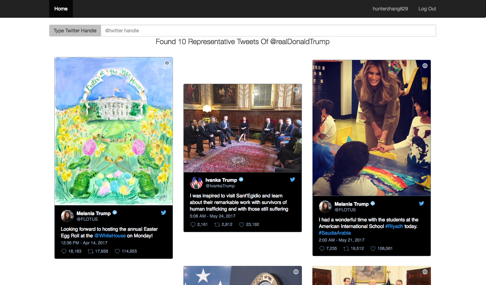

# getTweets

get the representative tweets

Keywords:NodeJS, ExpressJS, Twitter API, OAuth,

website link: <a>https://vast-coast-77959.herokuapp.com/ </a>

Use the Twitter API
```javascript
client.get('favorites/list', params, function(error, tweets, response){})
client.get('statuses/user_timeline', params, function(error, tweets, response){})

```
get the recently ten tweets and three favorite of the twitter handle

and get the representive tweets among them randomly, I print these tweets in the console and compare the final results
with them. It also can be checked the home page of the Twitter users, check the recently tweets and user's like tweets


<div  align="center"> 
 
</div>

Three Favorites Tweets of Donald Trump, It may be seen one of them in the front of them
```
[
{ created_at: 'Wed May 24 12:06:47 +0000 2017',
    id: 867351165180227600,
    id_str: '867351165180227584',
    text: 'I was inspired to visit Sant\'Egidio and learn about their remarkable work with survivors of human trafficking and w… https://t.co/Z6gD9rpJiW',
    truncated: true,
    entities: { hashtags: [], symbols: [], user_mentions: [], urls: [Object] },
    source: '<a href="http://twitter.com/download/iphone" rel="nofollow">Twitter for iPhone</a>',
    in_reply_to_status_id: null,
    in_reply_to_status_id_str: null,
    in_reply_to_user_id: null,
    in_reply_to_user_id_str: null,
    in_reply_to_screen_name: null,
    user:
     { id: 52544275,
       id_str: '52544275',
       name: 'Ivanka Trump',
       screen_name: 'IvankaTrump',
       location: 'New York, NY',
       description: 'Wife, mother, sister, daughter. Entrepreneur & advocate for the education & empowerment of women & girls. This is my personal page. Views expressed are my own.',
       url: null,
       entities: [Object],
       protected: false,
       followers_count: 4253621,
       friends_count: 952,
       listed_count: 18249,
       created_at: 'Tue Jun 30 22:32:03 +0000 2009',
       favourites_count: 1108,
       utc_offset: -18000,
       time_zone: 'Quito',
       geo_enabled: true,
       verified: true,
       statuses_count: 13479,
       lang: 'en',
       contributors_enabled: false,
       is_translator: false,
       is_translation_enabled: false,
       profile_background_color: 'C0DEED',
       profile_background_image_url: 'http://pbs.twimg.com/profile_background_images/378800000082251296/88912727d6e8e405d4a23881edd60def.jpeg',
       profile_background_image_url_https: 'https://pbs.twimg.com/profile_background_images/378800000082251296/88912727d6e8e405d4a23881edd60def.jpeg',
       profile_background_tile: true,
       profile_image_url: 'http://pbs.twimg.com/profile_images/882351803441987585/HWNkH-EK_normal.jpg',
       profile_image_url_https: 'https://pbs.twimg.com/profile_images/882351803441987585/HWNkH-EK_normal.jpg',
       profile_banner_url: 'https://pbs.twimg.com/profile_banners/52544275/1482433261',
       profile_link_color: 'FF6872',
       profile_sidebar_border_color: '000000',
       profile_sidebar_fill_color: 'DDEEF6',
       profile_text_color: '333333',
       profile_use_background_image: true,
       has_extended_profile: false,
       default_profile: false,
       default_profile_image: false,
       following: false,
       follow_request_sent: false,
       notifications: false,
       translator_type: 'none' },
    geo: null,
    coordinates: null,
    place: null,
    contributors: null,
    is_quote_status: false,
    retweet_count: 2812,
    favorite_count: 23192,
    favorited: false,
    retweeted: false,
    possibly_sensitive: false,
    lang: 'en' },
  { created_at: 'Sun May 21 09:00:15 +0000 2017',
    id: 866217061055434800,
    id_str: '866217061055434752',
    text: 'I had a wonderful time with the students at the American International School #Riyadh today. #SaudiaArabia https://t.co/AVzVV0W9Dm',
    truncated: false,
    entities:
     { hashtags: [Object],
       symbols: [],
       user_mentions: [],
       urls: [],
       media: [Object] },
    extended_entities: { media: [Object] },
    source: '<a href="http://twitter.com/download/iphone" rel="nofollow">Twitter for iPhone</a>',
    in_reply_to_status_id: null,
    in_reply_to_status_id_str: null,
    in_reply_to_user_id: null,
    in_reply_to_user_id_str: null,
    in_reply_to_screen_name: null,
    user:
     { id: 818876014390603800,
       id_str: '818876014390603776',
       name: 'Melania Trump',
       screen_name: 'FLOTUS',
       location: 'Washington, D.C.',
       description: 'This account is run by the Office of First Lady Melania Trump. Tweets may be archived. More at https://t.co/eVVzoBb3Zr',
       url: 'https://t.co/wyOVgSLgBV',
       entities: [Object],
       protected: false,
       followers_count: 7916533,
       friends_count: 4,
       listed_count: 3991,
       created_at: 'Tue Jan 10 17:43:50 +0000 2017',
       favourites_count: 0,
       utc_offset: -14400,
       time_zone: 'Eastern Time (US & Canada)',
       geo_enabled: false,
       verified: true,
       statuses_count: 104,
       lang: 'en',
       contributors_enabled: false,
       is_translator: false,
       is_translation_enabled: false,
       profile_background_color: 'F5F8FA',
       profile_background_image_url: null,
       profile_background_image_url_https: null,
       profile_background_tile: false,
       profile_image_url: 'http://pbs.twimg.com/profile_images/848946510918295557/RmsOl1zv_normal.jpg',
       profile_image_url_https: 'https://pbs.twimg.com/profile_images/848946510918295557/RmsOl1zv_normal.jpg',
       profile_banner_url: 'https://pbs.twimg.com/profile_banners/818876014390603776/1484852402',
       profile_link_color: '1DA1F2',
       profile_sidebar_border_color: 'C0DEED',
       profile_sidebar_fill_color: 'DDEEF6',
       profile_text_color: '333333',
       profile_use_background_image: true,
       has_extended_profile: false,
       default_profile: true,
       default_profile_image: false,
       following: false,
       follow_request_sent: false,
       notifications: false,
       translator_type: 'none' },
    geo: null,
    coordinates: null,
    place: null,
    contributors: null,
    is_quote_status: false,
    retweet_count: 19512,
    favorite_count: 106061,
    favorited: false,
    retweeted: false,
    possibly_sensitive: false,
    lang: 'en' },
  { created_at: 'Fri Apr 14 19:36:17 +0000 2017',
    id: 852968772088594400,
    id_str: '852968772088594434',
    text: 'Looking forward to hosting the annual Easter Egg Roll at the @WhiteHouse on Monday! https://t.co/nz7vucugx9',
    truncated: false,
    entities:
     { hashtags: [],
       symbols: [],
       user_mentions: [Object],
       urls: [],
       media: [Object] },
    extended_entities: { media: [Object] },
    source: '<a href="http://twitter.com/download/iphone" rel="nofollow">Twitter for iPhone</a>',
    in_reply_to_status_id: null,
    in_reply_to_status_id_str: null,
    in_reply_to_user_id: null,
    in_reply_to_user_id_str: null,
    in_reply_to_screen_name: null,
    user:
     { id: 818876014390603800,
       id_str: '818876014390603776',
       name: 'Melania Trump',
       screen_name: 'FLOTUS',
       location: 'Washington, D.C.',
       description: 'This account is run by the Office of First Lady Melania Trump. Tweets may be archived. More at https://t.co/eVVzoBb3Zr',
       url: 'https://t.co/wyOVgSLgBV',
       entities: [Object],
       protected: false,
       followers_count: 7916533,
       friends_count: 4,
       listed_count: 3991,
       created_at: 'Tue Jan 10 17:43:50 +0000 2017',
       favourites_count: 0,
       utc_offset: -14400,
       time_zone: 'Eastern Time (US & Canada)',
       geo_enabled: false,
       verified: true,
       statuses_count: 104,
       lang: 'en',
       contributors_enabled: false,
       is_translator: false,
       is_translation_enabled: false,
       profile_background_color: 'F5F8FA',
       profile_background_image_url: null,
       profile_background_image_url_https: null,
       profile_background_tile: false,
       profile_image_url: 'http://pbs.twimg.com/profile_images/848946510918295557/RmsOl1zv_normal.jpg',
       profile_image_url_https: 'https://pbs.twimg.com/profile_images/848946510918295557/RmsOl1zv_normal.jpg',
       profile_banner_url: 'https://pbs.twimg.com/profile_banners/818876014390603776/1484852402',
       profile_link_color: '1DA1F2',
       profile_sidebar_border_color: 'C0DEED',
       profile_sidebar_fill_color: 'DDEEF6',
       profile_text_color: '333333',
       profile_use_background_image: true,
       has_extended_profile: false,
       default_profile: true,
       default_profile_image: false,
       following: false,
       follow_request_sent: false,
       notifications: false,
       translator_type: 'none' },
    geo: null,
    coordinates: null,
    place: null,
    contributors: null,
    is_quote_status: false,
    retweet_count: 17658,
    favorite_count: 114855,
    favorited: false,
    retweeted: false,
    possibly_sensitive: false,
    lang: 'en' }
    ]

```